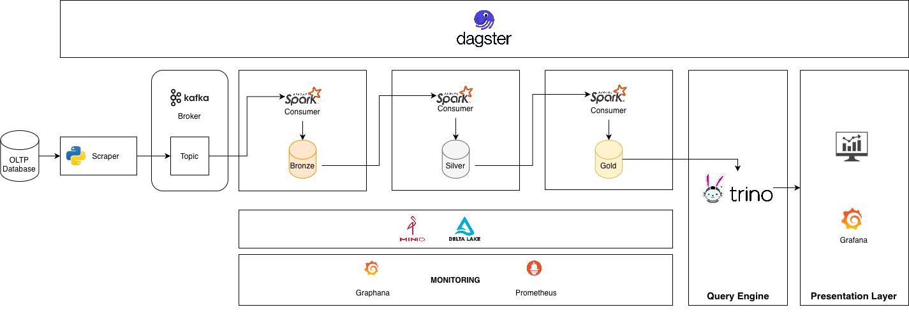

# Retail_Analysis_And_Management_Lakehouse




## Infra kick-start

```
docker compose up
```


## Run spark job

Install PySpark Locally follow instruction online

Run a job: 

```
/Users/khoaiquin/Storage/spark-3.5.7-bin-hadoop3/bin/spark-submit \
  --packages io.delta:delta-spark_2.12:3.1.0,org.apache.hadoop:hadoop-aws:3.3.4,com.amazonaws:aws-java-sdk-bundle:1.12.367,org.apache.spark:spark-sql-kafka-0-10_2.12:3.4.3 \
  bronze_streaming.py
```


## Minio

Install mc client

```
brew install minio/stable/mc

mc alias set local http://localhost:9000 minio minio123
```

Apply this policy to allow a table the ListBucket permission

```
mc anonymous set-json ./main/storage/policies/delta-bronze-policy.json local/bronze
```

Check for status

```
mc stat local/bronze
```

List all child

```
mc ls local/bronze
```


## Scraper

Run OLTP reader

```
python3 ./ingestion/source_reader.py
```

## Kafka

Monitor Kafka Topic in kafka container.

```
/opt/kafka/bin/kafka-console-consumer.sh \
  --bootstrap-server localhost:9092 \
  --topic retail_orders_raw \
  --from-beginning
```

# Prometheus

Manually setup Prometheus sink for Spark

```
curl -L -o spark-metrics_2.12-3.5.0.jar \
https://repo1.maven.org/maven2/org/apache/spark/spark-metrics_2.12/3.5.0/spark-metrics_2.12-3.5.0.jar

export SPARK_CLASSPATH=$PWD/spark-metrics_2.12-3.5.0.jar
```


# Trino

If gold has already packed with tables, only need to register the table in Trino (don't create a new table with same content):

```
CALL delta.system.register_table(
  schema_name => 'gold',
  table_name  => 'fact_sales',
  table_location => 's3a://gold/fact_sales'
);
```


# Dagster

Install dagster locally:

```
uv add dagster dagster-webserver dagster-postgres

dagster dev -m orchestration.retail_pipeline -p 3001
```
